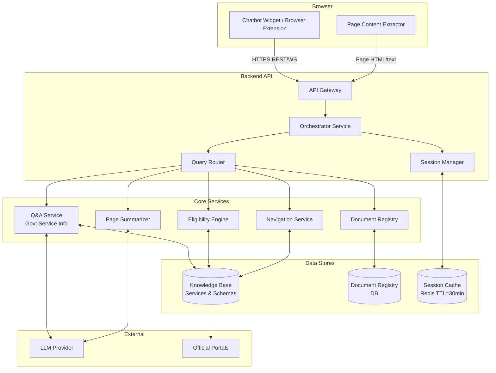

# Design Document

## Feature: Citizen Government Services Assistant

---

## Overview

The Citizen Government Services Assistant is a conversational AI chatbot embedded in government websites. It helps citizens navigate public services by answering questions about application processes, discovering eligible government schemes, listing required documents, and guiding users through website navigation — all within a session-scoped, privacy-preserving interaction.

The assistant is deployed as a widget on government web portals. It communicates with a backend API that orchestrates an LLM, a structured knowledge base of government services/schemes, and a document registry. No personal data is persisted beyond the active session.

Key design goals:
- Sub-5-second response latency for all query types
- Stateless backend with session state managed server-side in ephemeral storage (TTL 30 min)
- Multilingual support with native script rendering
- WCAG 2.1 AA compliant frontend widget
- Browser extension or injected widget for page summarization and navigation guidance

---

## Architecture



The orchestrator receives every citizen message, loads session context from the cache, routes the request to the appropriate core service, and returns a structured response. The LLM is used for natural language understanding, response generation, and page summarization. Structured data (schemes, documents, portals) lives in the knowledge base and document registry — the LLM does not hallucinate these; it formats and explains them.

---

## Components and Interfaces

### 1. Chatbot Widget (Frontend)

A self-contained web component (or browser extension content script) injected into government web pages.

Responsibilities:
- Render the chat UI in a corner overlay
- Send citizen messages to the backend API
- Render responses (markdown, structured lists, links)
- Support language selection UI
- Persist widget state across page reloads within the session (via sessionStorage)
- Highlight referenced UI elements on the host page (for navigation guidance)
- Extract visible page text/HTML for summarization requests

Interface (REST):
```
POST /api/v1/chat
Body: { sessionId, message, pageContext? }
Response: { sessionId, reply, replyType, metadata }
```

`pageContext` is an optional payload containing the current page URL and extracted visible text, sent when the citizen asks for page summarization or navigation help.

### 2. API Gateway

Thin HTTP layer handling:
- Auth (API key or JWT for the deploying authority)
- Rate limiting
- Request routing to the Orchestrator

### 3. Orchestrator Service

Central coordinator. For each request:
1. Load or create session from Session Manager
2. Classify intent (Q&A, eligibility, documents, navigation, summarization)
3. Dispatch to the appropriate core service
4. Merge response with session context
5. Persist updated session
6. Return structured response

### 4. Session Manager

Manages ephemeral session state in Redis with a 30-minute sliding TTL.

```
Session {
  sessionId: string
  language: string
  conversationHistory: Message[]
  pendingEligibilityDetails: PartialEligibilityInput | null
  createdAt: timestamp
  lastActiveAt: timestamp
}
```

On timeout or explicit reset, the session record is deleted — no personal data survives.

### 5. Query Router / Intent Classifier

Uses the LLM (with a lightweight classification prompt) to map citizen messages to one of:
- `GOVT_SERVICE_QA`
- `ELIGIBILITY_DISCOVERY`
- `DOCUMENT_REQUIREMENTS`
- `NAVIGATION_GUIDANCE`
- `PAGE_SUMMARIZATION`
- `FOLLOW_UP` (resolved using session history)
- `UNKNOWN`

### 6. Q&A Service

Handles Requirement 1. Looks up the government service in the knowledge base, then uses the LLM to generate a step-by-step explanation grounded in the KB entry. If multiple services match, returns a clarification prompt. If none match, returns a fallback with related suggestions.

### 7. Eligibility Engine

Handles Requirement 2. Accepts structured eligibility inputs (age, income, residency, etc.), evaluates them against scheme eligibility rules stored in the KB, and returns matching schemes. Prompts for missing required fields before evaluation. Never writes eligibility inputs to persistent storage.

### 8. Document Registry Service

Handles Requirement 3. Returns structured document lists for a given service or scheme, including mandatory vs. conditional classification and official portal links.

### 9. Navigation Service

Handles Requirement 6. Given a citizen's action request and the current page URL, returns step-by-step navigation instructions referencing specific UI elements (buttons, links, form fields) on that page. Falls back to the closest matching service path if the exact action is not found.

### 10. Page Summarizer

Handles Requirement 7. Accepts extracted page content (visible text + form structure) and uses the LLM to produce a concise summary: page purpose, main actions, key inputs required, and form steps if present. Must complete within 5 seconds.

---

## Data Models

### GovernmentService

```typescript
interface GovernmentService {
  id: string;
  name: string;                    // e.g. "Passport Application"
  aliases: string[];               // alternate names / keywords
  description: string;
  applicationSteps: Step[];
  officialPortalUrl: string;
  relatedServiceIds: string[];
}

interface Step {
  order: number;
  title: string;
  description: string;
  expandedDetail?: string;         // for Req 1.5 drill-down
}
```

### Scheme

```typescript
interface Scheme {
  id: string;
  name: string;
  purpose: string;
  benefitDescription: string;      // amount or type of benefit
  eligibilityCriteria: EligibilityCriterion[];
  officialPortalUrl: string;
  documentListId: string;
}

interface EligibilityCriterion {
  field: EligibilityField;         // e.g. "age", "income", "residency"
  operator: "lt" | "lte" | "gt" | "gte" | "eq" | "in";
  value: number | string | string[];
}

type EligibilityField = "age" | "annualIncome" | "residencyStatus" | "gender" | "occupation" | string;
```

### DocumentList

```typescript
interface DocumentList {
  id: string;
  serviceOrSchemeId: string;
  documents: DocumentEntry[];
}

interface DocumentEntry {
  name: string;
  description: string;
  isMandatory: boolean;
  condition?: string;              // e.g. "Required if applicant is a minor"
  obtainFromUrl?: string;
  submitToUrl?: string;
}
```

### Session

```typescript
interface Session {
  sessionId: string;
  language: string;                // BCP-47 tag e.g. "en", "hi", "ta"
  conversationHistory: Message[];
  pendingEligibilityInput: Partial<EligibilityInput> | null;
  createdAt: number;               // Unix ms
  lastActiveAt: number;
}

interface Message {
  role: "citizen" | "assistant";
  content: string;
  timestamp: number;
  intent?: IntentType;
}

interface EligibilityInput {
  age?: number;
  annualIncome?: number;
  residencyStatus?: string;
  gender?: string;
  occupation?: string;
  [key: string]: unknown;
}
```

### API Request / Response

```typescript
interface ChatRequest {
  sessionId: string | null;        // null for new sessions
  message: string;
  pageContext?: PageContext;
}

interface PageContext {
  url: string;
  visibleText: string;
  formFields?: string[];
}

interface ChatResponse {
  sessionId: string;
  reply: string;
  replyType: "text" | "list" | "clarification" | "summary" | "navigation" | "error";
  metadata?: {
    matchedServices?: string[];
    matchedSchemes?: Scheme[];
    documentList?: DocumentList;
    navigationSteps?: NavigationStep[];
    highlightTargets?: string[];   // CSS selectors or element descriptions
  };
}

interface NavigationStep {
  order: number;
  instruction: string;             // e.g. "Click 'Apply Online'"
  elementType?: "button" | "link" | "field" | "menu";
  elementLabel?: string;
}
```

---


## Correctness Properties

*A property is a characteristic or behavior that should hold true across all valid executions of a system — essentially, a formal statement about what the system should do. Properties serve as the bridge between human-readable specifications and machine-verifiable correctness guarantees.*

### Property 1: Service query returns structured steps

*For any* valid government service query, the assistant's response shall contain an ordered list of at least one step, where each step has a title and description.

**Validates: Requirements 1.1**

---

### Property 2: Ambiguous query triggers clarification

*For any* query that matches more than one government service in the knowledge base, the response type shall be `clarification` and the response metadata shall list all matched service names.

**Validates: Requirements 1.2**

---

### Property 3: Unrecognized query returns fallback with suggestions

*For any* query that matches no government service, the response shall not be empty and shall include at least one related service suggestion or a link to a general help resource.

**Validates: Requirements 1.3**

---

### Property 4: Step drill-down returns expanded detail

*For any* service step that has an `expandedDetail` field, when a citizen requests more detail on that step, the response content shall include the expanded detail text.

**Validates: Requirements 1.5**

---

### Property 5: Eligibility results satisfy all criteria

*For any* set of eligibility inputs, every scheme returned in the eligibility results shall have all of its eligibility criteria satisfied by those inputs — no scheme shall appear in results whose criteria the inputs do not meet.

**Validates: Requirements 2.1**

---

### Property 6: Scheme detail response contains required fields

*For any* scheme ID in the knowledge base, the scheme detail response shall include a non-empty purpose, a non-empty benefit description, and a valid URL for the official portal.

**Validates: Requirements 2.4**

---

### Property 7: Incomplete eligibility input prompts for missing fields

*For any* eligibility evaluation request where one or more required fields are absent, the response type shall be a prompt requesting the missing fields, and no scheme results shall be returned.

**Validates: Requirements 2.5**

---

### Property 8: Session data is ephemeral

*For any* session that has expired (TTL elapsed) or been explicitly reset, querying the session store for that session ID shall return no data — including any personal details (eligibility inputs) that were provided during the session.

**Validates: Requirements 2.6, 4.2**

---

### Property 9: Document list entries contain required fields

*For any* document list returned for a valid service or scheme, every document entry shall have a non-empty name, a non-empty description, and at least one non-empty portal URL (obtain or submit).

**Validates: Requirements 3.1, 3.2**

---

### Property 10: Conditional documents include their condition

*For any* document entry where `isMandatory` is `false`, the `condition` field shall be present and non-empty, describing the circumstance under which the document is required.

**Validates: Requirements 3.3**

---

### Property 11: Session context supports follow-up questions

*For any* session with at least one prior exchange, a follow-up question that references a previously mentioned service or scheme shall produce a response that correctly resolves the reference without the citizen re-providing the context.

**Validates: Requirements 4.1**

---

### Property 12: Session reset clears history

*For any* session with existing conversation history, after the citizen issues an explicit reset command, the session's conversation history shall be empty and the response shall confirm the reset.

**Validates: Requirements 4.3**

---

### Property 13: Language preference persists across session messages

*For any* session where the citizen has set a preferred language, every subsequent assistant response in that session shall be in the selected language until the preference is changed.

**Validates: Requirements 5.2, 5.5**

---

### Property 14: Navigation response contains ordered steps with element references

*For any* navigation query with a known page context, the response shall contain at least one navigation step, and each step shall include a non-empty instruction string and an element type or label identifying the UI element to interact with.

**Validates: Requirements 6.2, 6.3**

---

### Property 15: Portal link present when service has known portal URL

*For any* response about a government service or scheme that has a known `officialPortalUrl` in the knowledge base, the response metadata shall include that URL.

**Validates: Requirements 6.7**

---

### Property 16: Widget session survives page reload

*For any* active session, re-initializing the chatbot widget with the same `sessionId` (simulating a page reload) shall successfully retrieve the existing session and its conversation history from the session store.

**Validates: Requirements 6.5**

---

### Property 17: Page summary addresses purpose, actions, and required inputs

*For any* page content input of sufficient length and structure, the generated summary shall contain at least one sentence describing the page's purpose, at least one main action available, and at least one piece of key information the citizen must provide.

**Validates: Requirements 7.2**

---

## Error Handling

### Response Timeout
If any core service (Q&A, Eligibility, Document, Navigation, Summarizer) does not respond within 4.5 seconds, the Orchestrator returns an error response to the citizen with a retry prompt. The 0.5-second buffer accounts for network overhead against the 5-second SLA.

### LLM Failure
If the LLM provider returns an error or times out, the Orchestrator falls back to a template-based response using structured KB data where possible, or returns a graceful error message directing the citizen to the official portal.

### Session Store Unavailability
If Redis is unreachable, the Orchestrator creates an in-memory session for the duration of the request (stateless degraded mode). The citizen is notified that conversation history may not persist. No personal data is written to disk as a fallback.

### Unknown Intent
If the intent classifier returns `UNKNOWN` with confidence below threshold, the assistant asks the citizen to rephrase their question and offers example queries.

### Missing Knowledge Base Entry
If a service or scheme ID is not found in the KB, the service returns a structured "not found" response with related service suggestions derived from keyword similarity.

### Technical Error During Session (Req 4.4)
On any unhandled exception, the Orchestrator catches the error, logs it (without PII), returns an error response to the citizen, and preserves the session history up to the point of failure in the session cache.

### Unsupported Language (Req 5.3)
If the detected or requested language is not in the configured supported languages list, the assistant responds in the default language and lists the supported languages.

### Low-Confidence Page Summary (Req 7.6)
If the page summarizer's confidence score is below a configured threshold (e.g., the page content is too short or too ambiguous), the assistant informs the citizen it could not determine the page's purpose and invites a direct question.

---

## Testing Strategy

### Dual Testing Approach

Both unit tests and property-based tests are required. They are complementary:
- Unit tests cover specific examples, integration points, and error conditions
- Property-based tests verify universal correctness across randomized inputs

### Property-Based Testing

**Library**: [fast-check](https://github.com/dubzzz/fast-check) (TypeScript/JavaScript)

Each property-based test must:
- Run a minimum of **100 iterations**
- Be tagged with a comment referencing the design property:
  `// Feature: citizen-govt-services-assistant, Property N: <property_text>`
- Each correctness property in this document maps to exactly **one** property-based test

Property test targets:
- Eligibility engine (Properties 5, 7): generate random eligibility inputs and scheme sets
- Document registry (Properties 9, 10): generate random document lists and verify structural invariants
- Session manager (Properties 8, 11, 12, 16): generate random session states and message sequences
- Language handling (Property 13): generate random message sequences after language selection
- Q&A service (Properties 1, 2, 3, 4): generate random service queries against a mock KB
- Navigation service (Property 14): generate random action queries with mock page contexts
- Page summarizer (Property 17): generate random page content payloads

### Unit Testing

Unit tests focus on:
- Specific examples demonstrating correct behavior (e.g., a known passport application query returns the correct steps)
- Edge cases: empty document lists, expired sessions, unsupported languages, low-confidence summaries
- Error conditions: LLM timeout, session store unavailability, missing KB entries
- Integration points: Orchestrator routing to correct service, session load/save cycle

### Test Coverage Targets
- Core services (Q&A, Eligibility, Document, Navigation, Summarizer): 90% line coverage
- Session Manager: 95% line coverage (critical for privacy guarantees)
- Orchestrator: 85% line coverage

### Performance Testing
Response latency SLAs (Requirements 1.4, 7.7) are validated via load tests (e.g., k6 or Artillery) run separately from unit/property tests, targeting p95 < 5 seconds under expected concurrent load.
